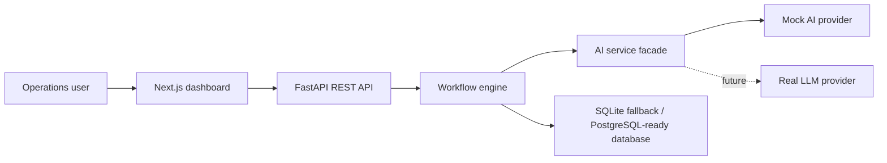
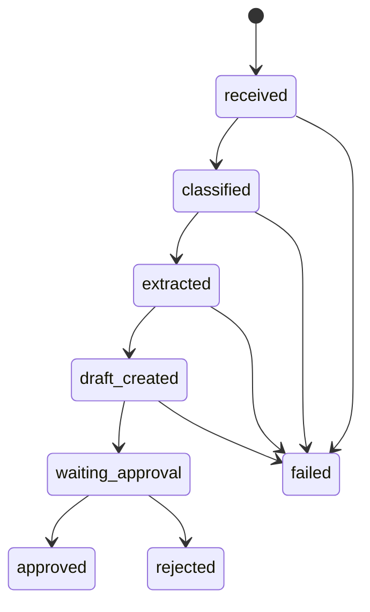

# Architecture

## System Overview

AI Ops Assistant is a demo-ready workflow product for processing operational requests with human approval. The MVP is split into a Next.js frontend, a FastAPI backend, a SQLite/PostgreSQL-ready persistence layer, and an AI service boundary that defaults to a mock provider when no LLM credentials exist.

## Components

- `frontend/`: Next.js App Router UI for dashboard metrics, request creation, request listing, and approval detail.
- `backend/app/api/`: FastAPI routers for request lifecycle and metrics.
- `backend/app/models/`: Pydantic and SQLAlchemy models.
- `backend/app/services/`: AI classifier, data extractor, draft generator, and workflow orchestration.
- `backend/app/database.py`: Engine/session setup, seed data, and SQLite fallback.
- `docs/`: Planning, traceability, prompt, and final review artifacts required by the hackathon.

## Workflow State Machine

## Data Model

`Request` records store the original demand plus AI-generated operational metadata.

| Field | Purpose |
| --- | --- |
| `id` | Primary identifier |
| `title` | Short request title |
| `content` | Original request body |
| `source` | `email`, `form`, `document`, or `manual` |
| `category` | AI classification |
| `priority` | AI priority estimate |
| `department` | Suggested responsible department |
| `extracted_fields` | JSON payload with important fields |
| `draft_response` | Turkish response draft |
| `status` | Workflow status |
| `manual_minutes_estimate` | Baseline manual handling estimate |
| `automated_minutes_estimate` | AI-assisted handling estimate |
| `created_at` / `updated_at` | Audit timestamps |

## API Endpoints

| Method | Path | Purpose |
| --- | --- | --- |
| `POST` | `/requests` | Create a request, run AI workflow, persist result |
| `GET` | `/requests` | List all requests |
| `GET` | `/requests/{id}` | Get one request detail |
| `POST` | `/requests/{id}/approve` | Mark AI draft as approved |
| `POST` | `/requests/{id}/reject` | Mark request as rejected |
| `GET` | `/metrics` | Return manual vs automated savings metrics |

## AI Provider Strategy

The backend uses a provider interface with `mock` as the default mode. A future LLM provider can be added behind the same methods without changing API handlers or frontend contracts. Secrets are read from environment variables and never committed.
